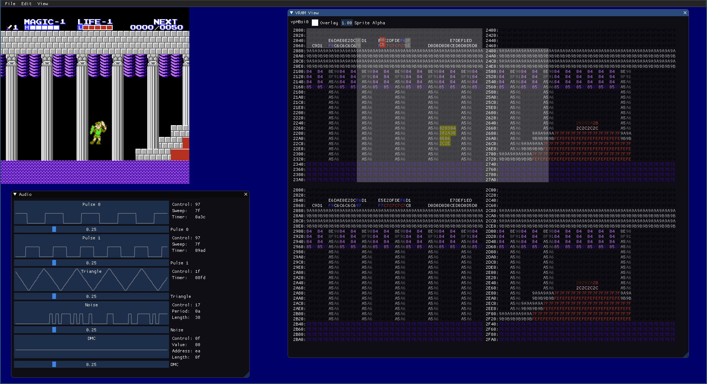

# ProtoNES in Rust

This is a work-in-progress port of my *ProtoNES* emulator from C++ to Rust.

The C++ codebase owes it's basic structure to
[Fogelman's NES](https://github.com/fogleman/nes), which is a wonderfully
easy to understand NES emulator in Golang.  The Rust port keeps the same
basic structure.

## Features

- Mappers: UxROM, AxROM, CxROM, MMC1 and MMC3.
- Visualization of the internal state of NES hardware:
  - Audio
  - Controller Inputs
  - CHR Banks
  - PPU & VRAM

## TODO

### Basic Functionality

- Improve framerate stability.
- State history (e.g. rewind).
- Play back FM2 movies.
- Add MMC5 mapper.
- Add other mappers as needed.

### User Interface

- Load preferences as rusty object notation (ron) from a file.

### Debug Functionality

- Memory Hexdump.
- Disassembly.
- CPU single stepping.
- Load user-supplied address/symbol definitions.

### Scripting

- Investigate adding Python support.

### Idiomatic Rust

- Refactor APU: Trait interfaces.
- Clean up in gui/app.
- Get a code review from someone knowledgable about Rust.

### Build

- Figure out cross-platform builds.
  - Linux
  - Windows
  - MacOS
